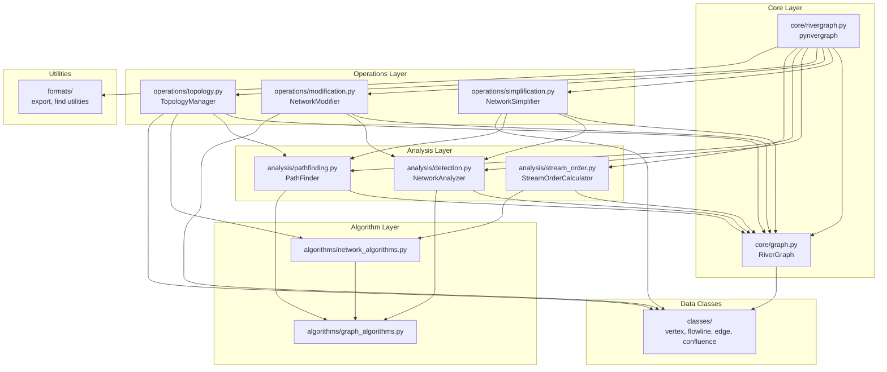

# PyRivergraph Modularization Plan

## Executive Summary

This document outlines a comprehensive plan to refactor the monolithic [`pyrivergraph`](../rivergraph/classes/rivergraph.py:28) class (~2000 lines) into smaller, focused modules to improve maintainability, testability, and code clarity.

## Current Structure Analysis

### Existing Architecture

```
rivergraph/
├── classes/
│   ├── rivergraph.py      (~2000 lines - MONOLITHIC)
│   ├── vertex.py          (248 lines - well-structured)
│   ├── flowline.py        (668 lines - well-structured)
│   ├── confluence.py      (112 lines - well-structured)
│   └── edge.py            (377 lines - well-structured)
└── formats/
    ├── export_flowline.py
    ├── export_vertex.py
    ├── find_index_in_list.py
    └── find_vertex_in_list.py
```

### Problem Areas in `rivergraph.py`

The [`pyrivergraph`](../rivergraph/classes/rivergraph.py:28) class contains 8 distinct functional areas:

1. **Graph Construction & Management** (lines 48-1679)
   - Initialization, vertex/edge mapping
   - Graph building and updates

2. **Network Simplification** (lines 147-733)
   - Remove disconnected flowlines
   - Remove braided channels
   - Remove parallel rivers
   - Remove cycles
   - Remove small rivers
   - Remove duplicates

3. **Network Analysis & Detection** (lines 738-1001)
   - Find braided channels
   - Find parallel paths
   - Detect cycles
   - Find linear segments

4. **Network Modification** (lines 1116-1308)
   - Split flowlines
   - Merge flowlines

5. **Stream Analysis & Topology** (lines 1314-1590)
   - Update stream order
   - Define stream segments
   - Define confluences
   - Define topology

6. **Path Finding & Analysis** (lines 1684-1803)
   - Find all paths
   - Path to flowlines conversion
   - Reachability analysis

7. **Vertex & Confluence Management** (lines 1836-1874)
   - Create confluence objects

8. **Stream Order Calculation** (lines 1879-1969)
   - Process confluences iteratively
   - Get upstream/downstream indices

## Proposed Modular Architecture

### Design Principles

1. **Single Responsibility**: Each module handles one cohesive set of operations
2. **Low Coupling**: Minimize dependencies between modules
3. **High Cohesion**: Group related functionality together
4. **Backward Compatibility**: Maintain existing API through facade pattern
5. **Testability**: Each module can be tested independently

### New Directory Structure

```
rivergraph/
├── __init__.py                    # Package initialization
├── classes/
│   ├── __init__.py
│   ├── vertex.py                  # KEEP AS-IS
│   ├── flowline.py                # KEEP AS-IS
│   ├── confluence.py              # KEEP AS-IS
│   └── edge.py                    # KEEP AS-IS
│
├── core/
│   ├── __init__.py
│   ├── graph.py                   # NEW: Core graph data structure
│   └── rivergraph.py              # NEW: Main facade class (thin wrapper)
│
├── operations/
│   ├── __init__.py
│   ├── simplification.py          # NEW: Network simplification operations
│   ├── modification.py            # NEW: Network modification operations
│   └── topology.py                # NEW: Topology definition operations
│
├── analysis/
│   ├── __init__.py
│   ├── detection.py               # NEW: Pattern detection (braids, cycles, etc.)
│   ├── pathfinding.py             # NEW: Path finding algorithms
│   └── stream_order.py            # NEW: Stream order calculations
│
├── algorithms/
│   ├── __init__.py
│   ├── graph_algorithms.py        # NEW: Generic graph algorithms (DFS, BFS, etc.)
│   └── network_algorithms.py     # NEW: River network specific algorithms
│
└── formats/
    ├── __init__.py
    ├── export_flowline.py         # KEEP AS-IS
    ├── export_vertex.py           # KEEP AS-IS
    ├── find_index_in_list.py      # KEEP AS-IS
    └── find_vertex_in_list.py     # KEEP AS-IS
```

## Detailed Module Breakdown

### 1. `core/graph.py` - Core Graph Data Structure

**Purpose**: Manage the fundamental graph data structure and basic operations

**Responsibilities**:
- Vertex and edge ID management
- Adjacency list maintenance
- Degree tracking (in/out)
- Basic graph queries (sources, sinks, vertex lookup)

**Key Classes/Functions**:
```python
class RiverGraph:
    """Core graph data structure without high-level operations"""

    def __init__(self, flowlines, outlet_vertex=None)
    def get_sources(self) -> List[int]
    def get_sinks(self) -> List[int]
    def get_vertices(self) -> List[pyvertex]
    def get_vertex_by_id(self, vertex_id: int) -> Optional[pyvertex]
    def get_vertex_count(self) -> int
    def _build_graph(self)
    def _update_graph_flowlines(self, new_flowlines)
```

**Lines from original**: 48-142, 1594-1679

---

### 2. `core/rivergraph.py` - Main Facade Class

**Purpose**: Provide backward-compatible API and coordinate between modules

**Responsibilities**:
- Maintain existing public API
- Delegate operations to specialized modules
- Coordinate multi-step operations

**Key Class**:
```python
class pyrivergraph:
    """
    Facade class that maintains backward compatibility.
    Delegates to specialized modules for actual operations.
    """

    def __init__(self, flowlines, pVertex_outlet=None):
        self._graph = RiverGraph(flowlines, pVertex_outlet)
        self._simplifier = NetworkSimplifier(self._graph)
        self._analyzer = NetworkAnalyzer(self._graph)
        # ... other components

    # Delegate methods to appropriate modules
    def remove_braided_river(self):
        return self._simplifier.remove_braided_river()

    def detect_cycles(self):
        return self._analyzer.detect_cycles()
```

**Lines from original**: Coordination logic only

---

### 3. `operations/simplification.py` - Network Simplification

**Purpose**: Operations that simplify the network by removing elements

**Responsibilities**:
- Remove disconnected flowlines
- Remove braided channels
- Remove parallel rivers
- Remove cycles
- Remove small rivers
- Remove duplicate flowlines

**Key Class**:
```python
class NetworkSimplifier:
    """Handles all network simplification operations"""

    def __init__(self, graph: RiverGraph)

    def remove_disconnected_flowlines(self, outlet_vertex=None) -> List[pyflowline]
    def remove_braided_river(self) -> List[pyflowline]
    def remove_parallel_river(self) -> List[pyflowline]
    def remove_cycle(self) -> List[pyflowline]
    def remove_small_river(self, threshold, iterations=3, ...) -> List[pyflowline]
    def remove_duplicate_flowlines(self, direction_insensitive=False) -> List[pyflowline]

    # Private helpers
    def _remove_small_river_step(self, flowlines, threshold)
    def _remove_duplicate_flowlines_direction_sensitive(self)
    def _remove_duplicate_flowlines_direction_insensitive(self)
```

**Lines from original**: 147-733

---

### 4. `operations/modification.py` - Network Modification

**Purpose**: Operations that modify network structure

**Responsibilities**:
- Split flowlines at vertices
- Merge linear flowline segments

**Key Class**:
```python
class NetworkModifier:
    """Handles network modification operations"""

    def __init__(self, graph: RiverGraph)

    def split_flowline(self, vertices=None, flag_intersect=None, flag_use_id=None) -> List[pyflowline]
    def merge_flowline(self) -> List[pyflowline]

    # Private helpers
    def _merge_flowline_segment(self, segment_flowlines) -> Optional[pyflowline]
```

**Lines from original**: 1116-1308

---

### 5. `operations/topology.py` - Topology Definition

**Purpose**: Define and manage stream network topology

**Responsibilities**:
- Define stream segments
- Define confluences
- Define stream topology
- Define stream order

**Key Class**:
```python
class TopologyManager:
    """Manages stream network topology"""

    def __init__(self, graph: RiverGraph)

    def define_stream_segment(self) -> Tuple[List[pyflowline], List[int]]
    def define_river_confluence(self) -> List[pyconfluence]
    def define_stream_topology(self) -> List[pyflowline]
    def define_stream_order(self, method=1) -> Tuple[List[pyflowline], List[int]]
    def update_headwater_stream_order(self) -> List[pyflowline]
    def identify_headwater_flowlines(self) -> List[pyflowline]

    # Private helpers
    def _sort_flowlines_from_outlet(self)
    def _create_confluence_object(self, vertex_id, vertex)
    def _process_confluences_iteratively(self, method)
```

**Lines from original**: 1314-1590, 1836-1874, 1879-1969

---

### 6. `analysis/detection.py` - Pattern Detection

**Purpose**: Detect patterns and features in the network

**Responsibilities**:
- Find braided channels
- Find parallel paths
- Detect cycles
- Find linear segments

**Key Class**:
```python
class NetworkAnalyzer:
    """Detects patterns and features in river networks"""

    def __init__(self, graph: RiverGraph)

    def find_braided_channels(self) -> List[List[pyflowline]]
    def find_parallel_paths(self) -> List[Dict]
    def detect_cycles(self) -> List[List[int]]

    # Private helpers
    def _find_partial_parallel_sections(self) -> List[Dict]
    def _find_reconvergence_points(self, divergence_id, max_depth=8)
    def _find_linear_segments(self) -> List[List[int]]
    def _build_bidirectional_segment(self, start_flowline_idx, ...)
    def _get_reachable_vertices(self, start_id, max_depth) -> Set[int]
    def find_first_common_vertex(self, reachable_list1, reachable_list2)
```

**Lines from original**: 738-1111

---

### 7. `analysis/pathfinding.py` - Path Finding

**Purpose**: Path finding and reachability analysis

**Responsibilities**:
- Find all paths between vertices
- Convert paths to flowlines
- Analyze reachability

**Key Class**:
```python
class PathFinder:
    """Path finding algorithms for river networks"""

    def __init__(self, graph: RiverGraph)

    def find_all_paths(self, start_id, target_id, max_depth=10) -> List[List[int]]
    def path_to_flowlines(self, path: List[int]) -> List[int]
    def find_outlet_reachable_vertices(self, outlet_vertex_id) -> Set[int]
    def get_upstream_indices(self, flowline) -> List[int]
    def get_downstream_indices(self, flowline) -> List[int]
```

**Lines from original**: 1684-1803, 1930-1969

---

### 8. `algorithms/graph_algorithms.py` - Generic Graph Algorithms

**Purpose**: Reusable graph algorithms (not river-specific)

**Responsibilities**:
- Depth-first search (DFS)
- Breadth-first search (BFS)
- Topological sorting
- Cycle detection
- Reachability analysis

**Key Functions**:
```python
def dfs(graph, start_node, visitor_fn=None)
def bfs(graph, start_node, visitor_fn=None)
def topological_sort(graph) -> List[int]
def detect_cycles_dfs(graph) -> List[List[int]]
def find_reachable_nodes(graph, start_node, max_depth=None) -> Set[int]
```

**Lines from original**: Extracted from various methods

---

### 9. `algorithms/network_algorithms.py` - River Network Algorithms

**Purpose**: River network specific algorithms

**Responsibilities**:
- Stream order calculation (Strahler, Shreve)
- Confluence processing
- Network traversal patterns

**Key Functions**:
```python
def calculate_strahler_order(confluences, flowlines)
def calculate_shreve_order(confluences, flowlines)
def process_confluences_iteratively(confluences, method)
def traverse_upstream(graph, start_vertex)
def traverse_downstream(graph, start_vertex)
```

**Lines from original**: Extracted from topology and stream order methods

---

## Module Dependency Diagram



## Refactoring Strategy

### Phase 1: Preparation (No Code Changes)
1. Create comprehensive test suite for existing functionality
2. Document current API and behavior
3. Set up new directory structure
4. Create `__init__.py` files

### Phase 2: Extract Core Graph (Minimal Breaking Changes)
1. Create [`core/graph.py`](../rivergraph/core/graph.py:1) with `RiverGraph` class
2. Move graph construction and management code
3. Update imports in existing code
4. Run tests to ensure no regression

### Phase 3: Extract Operations (Incremental)
1. Create [`operations/simplification.py`](../rivergraph/operations/simplification.py:1)
2. Move simplification methods
3. Create [`operations/modification.py`](../rivergraph/operations/modification.py:1)
4. Move modification methods
5. Create [`operations/topology.py`](../rivergraph/operations/topology.py:1)
6. Move topology methods
7. Run tests after each extraction

### Phase 4: Extract Analysis (Incremental)
1. Create [`analysis/detection.py`](../rivergraph/analysis/detection.py:1)
2. Move detection methods
3. Create [`analysis/pathfinding.py`](../rivergraph/analysis/pathfinding.py:1)
4. Move pathfinding methods
5. Create [`analysis/stream_order.py`](../rivergraph/analysis/stream_order.py:1)
6. Move stream order methods
7. Run tests after each extraction

### Phase 5: Extract Algorithms (Optional Enhancement)
1. Create [`algorithms/graph_algorithms.py`](../rivergraph/algorithms/graph_algorithms.py:1)
2. Extract generic graph algorithms
3. Create [`algorithms/network_algorithms.py`](../rivergraph/algorithms/network_algorithms.py:1)
4. Extract river-specific algorithms
5. Update dependent modules
6. Run tests

### Phase 6: Create Facade (Maintain Compatibility)
1. Create new [`core/rivergraph.py`](../rivergraph/core/rivergraph.py:1) as thin facade
2. Implement delegation to specialized modules
3. Ensure 100% API compatibility
4. Update main package `__init__.py` to export facade
5. Run full test suite

### Phase 7: Documentation & Migration
1. Update all docstrings
2. Create migration guide
3. Update examples
4. Create architecture documentation

## Breaking Changes & Mitigation

### Potential Breaking Changes

1. **Import paths change**
   - Old: `from rivergraph.classes.rivergraph import pyrivergraph`
   - New: `from rivergraph.core.rivergraph import pyrivergraph`

   **Mitigation**: Keep old import working via `__init__.py`:
   ```python
   # rivergraph/__init__.py
   from rivergraph.core.rivergraph import pyrivergraph

   # rivergraph/classes/__init__.py
   from rivergraph.core.rivergraph import pyrivergraph  # Backward compat
   ```

2. **Internal method access**
   - Private methods (starting with `_`) may move to different modules

   **Mitigation**: Document that private methods are not part of public API

3. **Direct attribute access**
   - Some internal attributes may be encapsulated

   **Mitigation**: Provide property accessors for commonly used attributes

### Backward Compatibility Guarantee

The facade pattern ensures that **all existing public methods remain accessible** through the main `pyrivergraph` class with identical signatures and behavior.

## Testing Strategy

### Unit Tests
- Each new module gets its own test file
- Test modules independently with mocked dependencies
- Aim for >80% code coverage per module

### Integration Tests
- Test interactions between modules
- Verify facade correctly delegates to modules
- Test complete workflows end-to-end

### Regression Tests
- Run existing test suite against new architecture
- Ensure all existing functionality works identically
- Performance benchmarks to detect regressions

## Benefits of This Approach

### Maintainability
- **Smaller files**: Each module <500 lines vs 2000 lines
- **Clear responsibilities**: Easy to find where functionality lives
- **Easier debugging**: Isolated modules simplify troubleshooting

### Testability
- **Unit testing**: Test each module independently
- **Mocking**: Easy to mock dependencies
- **Coverage**: Better test coverage tracking per module

### Extensibility
- **New features**: Add new analyzers or operations without touching core
- **Customization**: Override specific modules for custom behavior
- **Plugins**: Potential for plugin architecture

### Code Quality
- **Single Responsibility**: Each module has one clear purpose
- **Reduced coupling**: Modules depend on interfaces, not implementations
- **Better documentation**: Smaller modules are easier to document

## Migration Guide for Users

### For Basic Users (No Code Changes Needed)

If you're using the standard API:
```python
from rivergraph.classes.rivergraph import pyrivergraph

# This continues to work exactly as before
graph = pyrivergraph(flowlines, outlet_vertex)
graph.remove_braided_river()
graph.detect_cycles()
```

### For Advanced Users (Minimal Changes)

If you're importing from specific modules:
```python
# Old way
from rivergraph.classes.rivergraph import pyrivergraph

# New way (recommended)
from rivergraph import pyrivergraph

# Or explicitly
from rivergraph.core.rivergraph import pyrivergraph
```

### For Developers Extending the Library

New modular structure allows targeted imports:
```python
# Import only what you need
from rivergraph.core.graph import RiverGraph
from rivergraph.analysis.detection import NetworkAnalyzer
from rivergraph.operations.simplification import NetworkSimplifier

# Build custom workflows
graph = RiverGraph(flowlines)
analyzer = NetworkAnalyzer(graph)
cycles = analyzer.detect_cycles()
```

## Implementation Timeline

### Estimated Effort

- **Phase 1 (Preparation)**: 2-3 days
- **Phase 2 (Core Graph)**: 3-4 days
- **Phase 3 (Operations)**: 5-7 days
- **Phase 4 (Analysis)**: 5-7 days
- **Phase 5 (Algorithms)**: 3-5 days (optional)
- **Phase 6 (Facade)**: 2-3 days
- **Phase 7 (Documentation)**: 3-4 days

**Total**: 23-33 days (4-7 weeks)

### Recommended Approach

1. **Start with Phase 1-2**: Get core graph working
2. **Incremental rollout**: One operation module at a time
3. **Continuous testing**: Run tests after each change
4. **Early feedback**: Get user feedback after Phase 3
5. **Iterate**: Adjust based on feedback

## Success Criteria

- ✅ All existing tests pass
- ✅ No breaking changes to public API
- ✅ Each module <500 lines
- ✅ Test coverage >80% per module
- ✅ Documentation complete
- ✅ Migration guide available
- ✅ Performance within 5% of original

## Conclusion

This modularization plan transforms the monolithic [`pyrivergraph`](../rivergraph/classes/rivergraph.py:28) class into a well-organized, maintainable architecture while preserving backward compatibility. The facade pattern ensures existing code continues to work, while the new modular structure enables better testing, easier maintenance, and future extensibility.

The key insight is to **separate concerns** without breaking existing functionality, allowing for a smooth transition that benefits both maintainers and users.